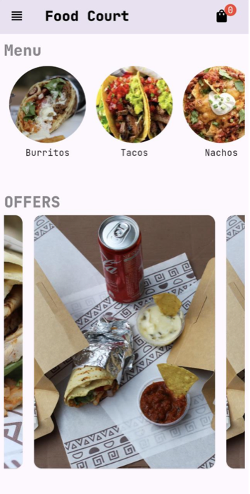
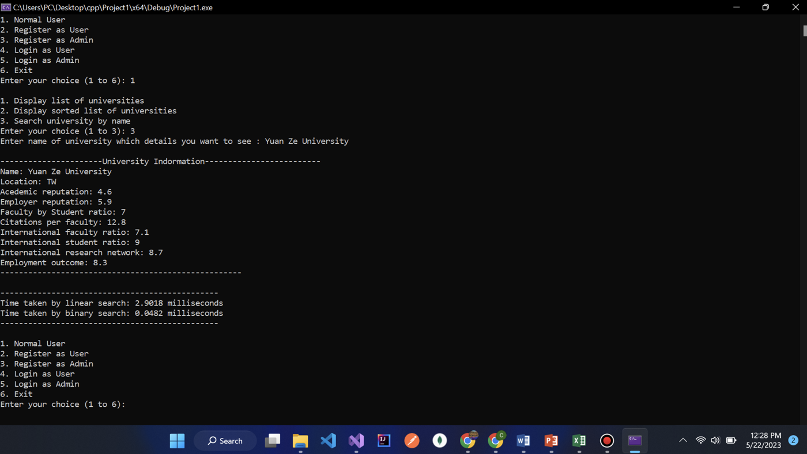

<h1 align="center">Hi, I'm Abdelrahman Mohamed 👋</h1>

<h3 align="center">Full-Stack Software Developer</h3>

  I build practical products across web, mobile, backend, and desktop—turning ideas into 
  clear user experiences backed by maintainable, well-structured engineering.

  
  
  
  

  
  
  

---

## A quick introduction

<table>
  <tr>
    <td width="33%" valign="top">
      <h3>🎓 Computer Science</h3>
      
Dual-degree graduate from Asia Pacific University, Malaysia and De Montfort University, UK.

    </td>
    <td width="33%" valign="top">
      <h3>🏅 Frontend certified</h3>
      
Meta Front-End Developer Professional Certificate, backed by hands-on React and interface work.

    </td>
    <td width="33%" valign="top">
      <h3>🧩 End-to-end builder</h3>
      
Comfortable moving from user interface and application logic to data, integrations, and delivery.

    </td>
  </tr>
</table>

---

## Featured work

<table>
  <tr>
    <td width="34%" align="center" valign="middle">
      
    </td>
    <td width="66%" valign="middle">
      <h2>🍽️ Restaurant Canteen App</h2>
      
A complete Flutter ordering experience with customer and manager workflows.

      <ul>
        <li>Firebase authentication and real-time restaurant data</li>
        <li>Menus, product options, persistent cart, and order history</li>
        <li>Location-aware checkout and Google Maps integration</li>
        <li>Structured GetX state management and reusable widgets</li>
      </ul>
      

        
        
        
        
      

      
<a href="https://portfolio-three-weld-1nl59zz6ir.vercel.app/projects/restaurant-canteen"><strong>Case study</strong></a> · <a href="https://github.com/AbdelrahmanMohamed7/restaurant-canteen-app"><strong>Source code →</strong></a>

    </td>
  </tr>
</table>

 

<table>
  <tr>
    <td width="58%" valign="middle">
      <h2>🎓 Global University Ranking Engine</h2>
      
A C++ analytics and recommendation system built around real university-ranking data.

      <ul>
        <li>Searches, filters, recommendations, and user/admin flows</li>
        <li>Custom sorting and searching algorithm implementations</li>
        <li>File-based persistence and feedback workflows</li>
        <li>Benchmarks across more than 1,400 university records</li>
      </ul>
      

        
        
        
        
      

      
<a href="https://portfolio-three-weld-1nl59zz6ir.vercel.app/projects/global-university"><strong>Case study</strong></a> · <a href="https://github.com/AbdelrahmanMohamed7/global-university-ranking-engine"><strong>Source code →</strong></a>

    </td>
    <td width="42%" align="center" valign="middle">
      
    </td>
  </tr>
</table>

### More engineering projects

<table>
  <tr>
    <td width="50%" valign="top">
      <h3>🏥 Medical Records Access Platform</h3>
      
Vue and Express authorization workflows with dedicated admin, doctor, and patient experiences plus dual Redis permission mappings.

      
<strong>Vue · Express.js · Redis · Docker</strong>

      <a href="https://github.com/AbdelrahmanMohamed7/medical-blockchain-project">View repository →</a>
    </td>
    <td width="50%" valign="top">
      <h3>💼 Enterprise Payroll System</h3>
      
Java desktop payroll management with employee records, automated calculations, role-based access, auditing, SQLite, and PDF reports.

      
<strong>Java · Swing · SQLite · iText</strong>

      <a href="https://github.com/AbdelrahmanMohamed7/enterprise-payroll-system-public">View repository →</a>
    </td>
  </tr>
  <tr>
    <td width="50%" valign="top">
      <h3>🚗 Car Rental Fleet Tracker</h3>
      
Java fleet management for vehicle records, customers, availability, bookings, returns, due dates, and fine tracking.

      
<strong>Java · Swing · CRUD · Desktop</strong>

      <a href="https://github.com/AbdelrahmanMohamed7/car-rental-fleet-tracker">View repository →</a>
    </td>
    <td width="50%" valign="top">
      <h3>🎮 Procedural 2D Physics Engine</h3>
      
A console simulation exploring procedural motion, configurable game-loop behavior, scoring, and ASCII rendering.

      
<strong>C · Simulation · Procedural Programming</strong>

      <a href="https://github.com/AbdelrahmanMohamed7/procedural-2D-physics-engine">View repository →</a>
    </td>
  </tr>
</table>

---

## Technology toolkit

<h4 align="center">Frontend & Mobile</h4>

  

<h4 align="center">Backend, Data & Core Engineering</h4>

  

<h4 align="center">Tools</h4>

  

---

  <h2>Let's build something useful.</h2>
  
I'm open to full-stack software development roles, remote opportunities, and practical product collaborations.

  

    <a href="mailto:bodabanzen1818@gmail.com"><strong>Email me</strong></a>
    &nbsp;·&nbsp;
    <a href="https://portfolio-three-weld-1nl59zz6ir.vercel.app/"><strong>Visit my portfolio</strong></a>
    &nbsp;·&nbsp;
    <a href="assets/Abdelrahman_Mohamed_CV_Professional.pdf"><strong>Read my résumé</strong></a>
  

