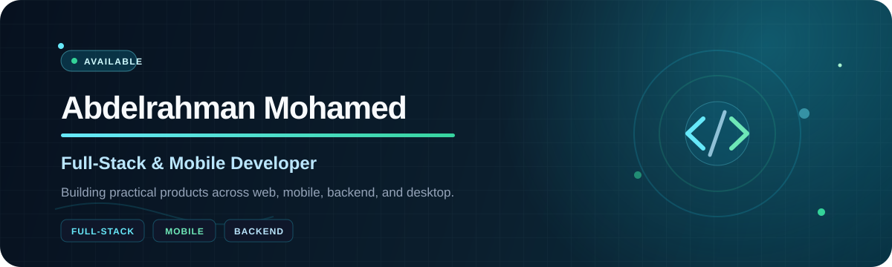

  

  <h3>Turning ideas into practical, well-structured products.</h3>
  

    I build end-to-end experiences across web, mobile, backend, and desktop— 
    with a focus on clean architecture, usable interfaces, and code that is easy to understand and extend.
  

  

    
    
    
    
  

---

## Selected work

<table>
  <tr>
    <td width="33%" valign="top">
      <h3>🍽️ Restaurant Canteen</h3>
      
A complete Flutter ordering experience with customer and manager flows, real-time menu data, cart persistence, location-aware checkout, and order tracking.

      
<strong>Flutter · Dart · Firebase · GetX</strong>

      <a href="https://github.com/AbdelrahmanMohamed7/restaurant-canteen-app"><strong>Explore the project →</strong></a>
    </td>
    <td width="33%" valign="top">
      <h3>💼 Enterprise Payroll</h3>
      
A Java desktop system for employee records, automated salary calculations, role-based access, audit tracking, SQLite persistence, and PDF reporting.

      
<strong>Java · Swing · SQLite · iText</strong>

      <a href="https://github.com/AbdelrahmanMohamed7/enterprise-payroll-system-public"><strong>Explore the project →</strong></a>
    </td>
    <td width="33%" valign="top">
      <h3>🏥 Medical Records Access</h3>
      
A full-stack authorization platform with dedicated admin, doctor, and patient flows plus dual Redis mappings for secure record permissions.

      
<strong>Vue · Express.js · Redis · Docker</strong>

      <a href="https://github.com/AbdelrahmanMohamed7/medical-blockchain-project"><strong>Explore the project →</strong></a>
    </td>
  </tr>
</table>

### More projects

- **[Global University Ranking Engine](https://github.com/AbdelrahmanMohamed7/global-university-ranking-engine)** — C++ searching, sorting, recommendations, file processing, and performance benchmarks across 1,400+ records.
- **[Car Rental Fleet Tracker](https://github.com/AbdelrahmanMohamed7/car-rental-fleet-tracker)** — Java fleet management for vehicles, customers, availability, bookings, returns, due dates, and fines.
- **[Procedural 2D Physics Engine](https://github.com/AbdelrahmanMohamed7/procedural-2D-physics-engine)** — A C-based console simulation exploring procedural motion, game-loop behavior, scoring, and ASCII rendering.

---

## Technologies I use

  

 

<table>
  <tr>
    <td width="33%" valign="top">
      <h3>🖥️ Product interfaces</h3>
      
Responsive web applications, Flutter mobile experiences, and structured Java desktop interfaces.

    </td>
    <td width="33%" valign="top">
      <h3>⚙️ Application logic</h3>
      
Authentication, role-based access, APIs, state management, databases, and real-world business workflows.

    </td>
    <td width="33%" valign="top">
      <h3>🧱 Engineering foundations</h3>
      
Object-oriented design, data structures, algorithms, concurrency, file handling, and maintainable project structure.

    </td>
  </tr>
</table>

---

## Currently focused on

- Building polished full-stack and mobile applications from interface to data layer
- Strengthening clean architecture, backend design, and production-ready delivery
- Exploring software development roles and remote collaboration opportunities

  <h3>Have a product idea or an engineering opportunity?</h3>
  

    <a href="mailto:bodabanzen1818@gmail.com"><strong>Let's talk</strong></a>
    &nbsp;·&nbsp;
    <a href="https://portfolio-three-weld-1nl59zz6ir.vercel.app/"><strong>View my portfolio</strong></a>
    &nbsp;·&nbsp;
    <a href="assets/Abdelrahman_Mohamed_CV_Professional.pdf"><strong>Read my résumé</strong></a>
  

